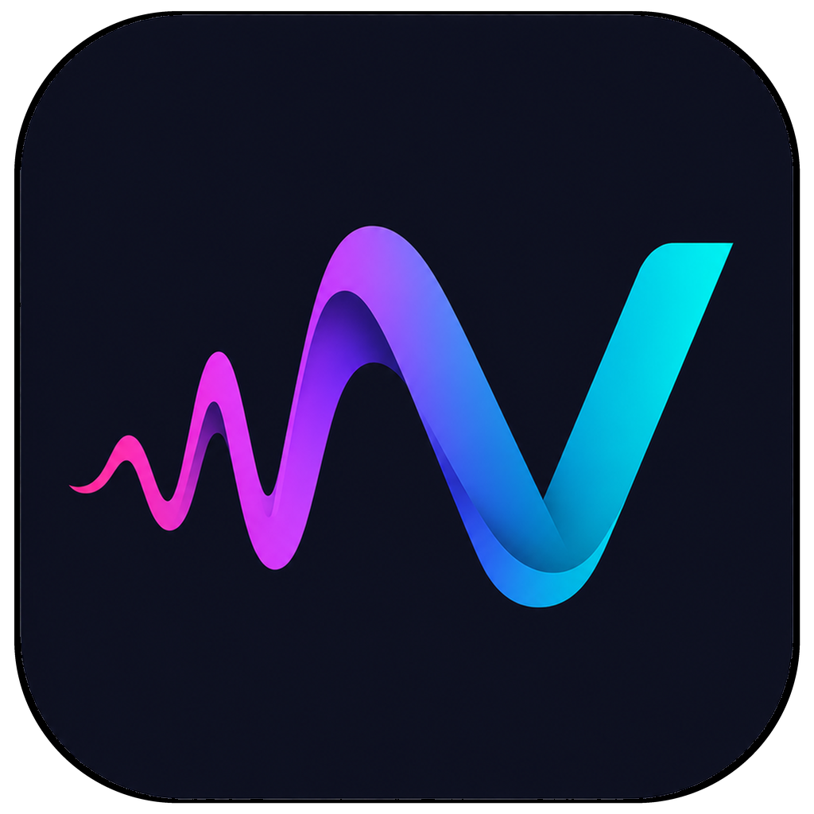

# VaaniFlow

<p align="center">
  
</p>

<p align="center">
  <strong>Fast, system-wide voice dictation for Windows.</strong><br />
  Speak naturally and insert polished text into any application.
</p>

VaaniFlow started as a side project to make everyday typing faster and more natural. It is now open source so others can use it, improve it, and help shape where it goes next.

The desktop app, currently named **Vaani**, runs from the system tray. Hold a global shortcut, speak, and release—the transcript is inserted wherever your cursor is.

## Features

- **System-wide dictation** with push-to-talk and hands-free recording modes
- **Fast transcription** using Azure OpenAI Whisper, including background chunking for longer recordings
- **Optional AI polishing** with configurable cleanup and writing styles for messages, work, email, and other apps
- **Personal dictionary** for names, jargon, acronyms, preferred spellings, and text replacements
- **Voice snippets** that expand spoken trigger phrases into reusable text
- **Voice commands** for punctuation, paragraphs, and corrections such as “scratch that”
- **Per-app behavior** with app-aware writing styles and terminal-friendly paste handling
- **History and insights** for search, activity, word counts, speed, streaks, and app usage
- **Local-first storage** for settings, transcripts, dictionary entries, snippets, and profile data
- **Resilient processing** with retries, failed-audio recovery, silence trimming, and automatic updates

## Getting started

VaaniFlow currently supports Windows and requires your own Azure OpenAI resource with a Whisper deployment.

```bash
git clone https://github.com/Abbhiishek/vaaniflow.git
cd vaaniflow
npm install
npm start
```

Add your provider details from **Settings → Provider**, or edit the configuration created at `%APPDATA%/vaani/config.json`:

```json
{
  "baseUrl": "https://your-resource.openai.azure.com",
  "apiKey": "your-api-key",
  "apiVersion": "2024-10-21",
  "whisperDeployment": "whisper",
  "llmDeployment": "gpt-4o"
}
```

`llmDeployment` is optional and is only needed for AI cleanup and style formatting. The default shortcut is `Ctrl + Win`: hold it while speaking, then release to transcribe and paste.

## Privacy

VaaniFlow has no required account, sign-in, or hosted backend. Your app data remains on your device, and audio is sent only to the Azure OpenAI resource you configure. Provider credentials are stored locally in the user-editable configuration file, so keep that file private.

## Roadmap and future scope

VaaniFlow is still evolving. Potential additions include:

- Pluggable transcription and language-model providers, including custom and local models
- Optional accounts for encrypted sync, backup, and shared settings across devices
- macOS and Linux support
- More languages, accessibility options, and configurable voice commands
- Import and export for history, dictionaries, snippets, and preferences
- Deeper app integrations and a plugin or extension system

These are directions for the project rather than committed release dates. Ideas and contributions are welcome.

## Development

```bash
npm test       # run the test suite
npm run smoke  # launch the Electron smoke test
npm run dist   # build the Windows installer
```

VaaniFlow uses plain Electron without a frontend framework. The main process handles recording sessions, transcription, polishing, persistence, global shortcuts, and text injection; the renderer provides the recording overlay and dashboard.

## Contributing

Bug reports, feature proposals, documentation improvements, and pull requests are welcome. Please open an issue before starting a large change so the approach can be discussed early.

## License

VaaniFlow is available under the MIT License.
